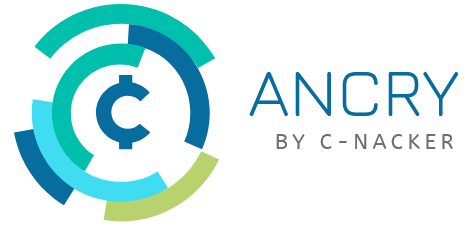

# [anCry] an anonymous cryptocurrency

##### *anCry will be a new cryptocurrency that guarantees the anonymity of your transactions.*

>The anCry-Core is already in the implementation phase. Currently we are developing closed-source. Once the core is completed, it will be published here on GitHub

### More information
* anCry will not use Proof-of-Work as in other cryptocurrencies. It will use a newly developed process called **Proof-of-Luck**.
* The anonymity of your transactions is guaranteed by symmetric and asymmetric encryption.
anCry will be programmed using a variety of programming languages. The core will be written in Go.
* The project is currently in the planning phase. The anCry-Core is already being implemented.

## Proof-of-Luck Concept
Unlike the Proof-of-Work process, Proof-of-Luck is not resource-intensive. Each user who performs a transaction creates a hash and if selected a block of the Blockchain. The complete Blockchain is located at the so-called Full-Nodes.
More information coming soon...

## FaTP (Full anonymous Transaction Protocol)
A technology that guarantees fully anonymous transactions.
More information coming soon...
